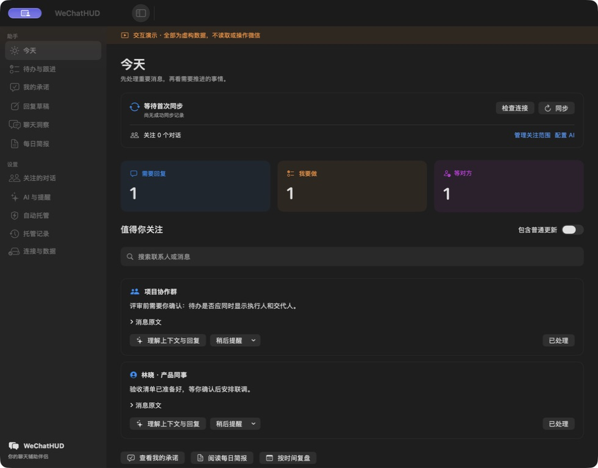
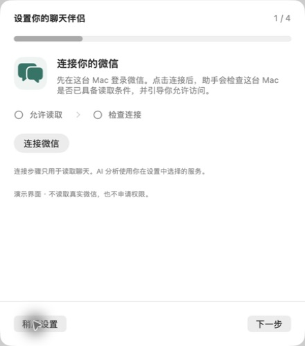
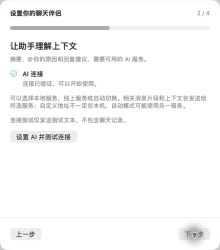

<p align="center">
  
</p>

<h1 align="center">WeChatHUD</h1>

<p align="center">
  <strong>住在 Mac 刘海里的微信助手。</strong><br>
  你只选要关注的对话，它替你盯住：该回的、该做的、你答应过的——平时安静，有事才出现。
</p>

<p align="center">
  <a href="https://github.com/samwang0041-star/WeChatHUD/releases/latest"></a>
  
  
  
</p>

<p align="center">
  <a href="https://github.com/samwang0041-star/WeChatHUD/releases/latest/download/WeChatHUD-1.2.22-macOS14-arm64.zip"><strong>下载安装包</strong></a>
  ·
  <a href="docs/user-guide.md">使用指南</a>
  ·
  <a href="#三分钟上手">三分钟上手</a>
  ·
  <a href="#从源码构建">自己编译</a>
</p>

<br>

<p align="center">
  
</p>

<p align="center"><em>
  消息到达时，刘海下展开一张能直接处理的通知：谁找你、什么事、什么情况、去微信——不用切窗口。
</em></p>

---

## 消息太多，要紧的事不该被淹没

群在刷，人在找，你答应的事散在几百条消息里。WeChatHUD 只做一件事：<strong>把聊天变成你一眼能处理的工作线索</strong>。

- 它<b>只读</b>你选中的对话，在本机整理出「需要你处理」的队列
- 每条都带上<strong>谁、什么事、第几分钟</strong>，点开就是摘要、原文和下一步
- 回不了就先存草稿、稍后提醒、或一键标已处理——<strong>没有你的确认，它什么都不发</strong>

## 一个「今天」，装下所有要紧事

<p align="center">
  
</p>

<table>
  <tr>
    <td width="50%">

**今天**

该回的消息、要做的事、在等对方的事，分列三张卡。数量不对就是有人没处理完——看一眼就知道。

**我的承诺**

「我明天发你」会被记下来：谁、什么事、截止时间、原话出处。做完了再勾掉，不靠自动整理下结论。

    </td>
    <td width="50%">

**群里 @ 你**

「看看什么事」一句话讲清：发生了什么、为什么找你、下一步怎么办。拿不准就回原文核对。

**回复草稿**

AI 起草，你来改。存着、继续写、复制、或确认后送出——每一步都先让你看清发给谁、发什么。

    </td>
  </tr>
  <tr>
    <td width="50%">

**每日简报**

今天处理了什么、还压着什么事，一页读完，可导出 Markdown。

**按时间复盘**

选一段对话、一段时间，回看当时的决定和话题走向。

    </td>
    <td width="50%">

**自动托管（默认关闭）**

开了也先进「待确认」队列。群聊不自动发；转账、红包、验证码强制人工；每会话有发送上限。

**多账号隔离**

换微信账号，待办、草稿、关注名单各自独立保存，互不串。

    </td>
  </tr>
</table>

## 三分钟上手

1. **下载** [`WeChatHUD-1.2.22-macOS14-arm64.zip`](https://github.com/samwang0041-star/WeChatHUD/releases/latest/download/WeChatHUD-1.2.22-macOS14-arm64.zip)，解压拖进「应用程序」——已签名并公证，双击即开。
2. **先登录微信**，再点「连接微信」。系统授权窗口点「允许读取」即可，不用自己找文件夹。
3. **选一个要关注的人或群**——从一个开始就够了。

<table>
  <tr>
    <td align="center" width="50%"><br><sub>连接本机已登录的微信</sub></td>
    <td align="center" width="50%"><br><sub>AI 是可选项，测试连接只发测试文本</sub></td>
  </tr>
</table>

> 需要 macOS 14+、Apple 芯片、这台 Mac 已登录微信。跳转微信或送草稿时，系统可能要求一次「辅助功能」授权，按提示打开即可。

## 你的数据，留在你的 Mac 上

| 问题 | 答案 |
| --- | --- |
| 聊天记录存哪？ | 只在本机读取微信数据库；整理结果保存在 `~/.wechat-hud` |
| 会上传到你们服务器吗？ | 不会——没有云端账号，也没有我们的服务器 |
| AI 用到什么数据？ | 打开 AI 后，相关片段发给你<b>自选</b>的服务（DeepSeek、Kimi、智谱、本机 Codex 等） |
| 它会自动发消息吗？ | 不会。发送前一定让你确认收件人和内容；托管默认关闭 |
| 会改我的微信吗？ | 不会。源库只读，聊天记录不被改动 |

更细的边界见 [使用指南](docs/user-guide.md) 与 [分发说明](docs/distribution.md)。

## 从源码构建

需要 Xcode 命令行工具（SwiftPM 直接构建，无 Xcode 工程）：

```bash
make app && make run          # 编译并打开
make test                     # 1115 项测试
make package                  # 签名打包 zip + SHA-256
```

想先逛逛界面？演示模式用虚构资料，不碰真实微信：

```bash
make preview
open ".build/WeChatHUD Preview.app"
```

## 文档

- [使用指南](docs/user-guide.md) — 连接、日常使用、权限、排障
- [分发说明](docs/distribution.md) — 签名、公证、打包流程
- [进化日志](docs/evolution-log.md) — 每个版本改了什么
- [产品化说明](docs/2026-09-07-productization.md) — 设计取舍与验收边界

---

<p align="center">
  <sub>当前正式版 <strong>1.2.22</strong> · 源码与安装包同仓 · 应用内可检查更新</sub><br>
  <sub>用之前建议先读一遍 <a href="docs/user-guide.md">使用指南</a></sub>
</p>
